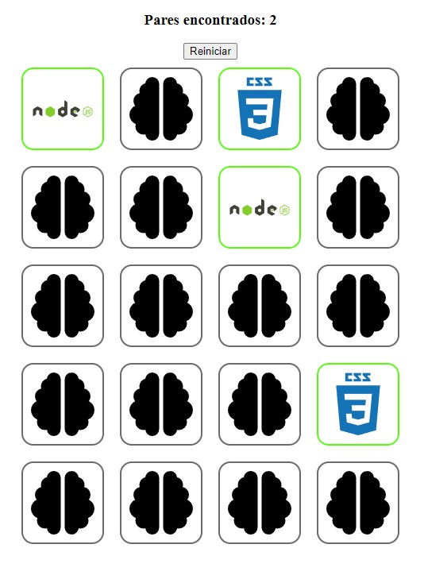

# Jogo da memória

Esse é um jogo da memória criado com o intuito de exercitar habilidades em Javascript

Alguns dos desafios enfrentados para criação deste jogo:
- Criação do quadro com imagens
- Randomizar a posição das imagens
- Virar as imagens selecionadas
- Alterar pontuação de acordo com acertos

  

